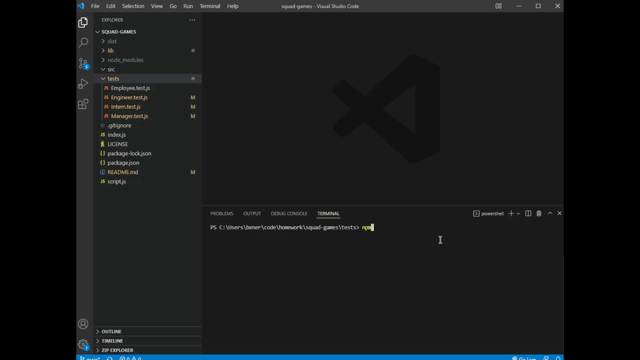

# Squad Games &middot; [](https://opensource.org/licenses/MIT)   
   
  Squad Games is a back end Node app that allows you to easily generate an HTML file with descriptions of your team of employees. Parameters of employee ID, name, and email are given to all employees with each role having their own specific case. Inputs are used to generate HTML that puts employee info into a card layout.   

  
     
  ## Table of Contents  
  &middot; [Installation](#installation)  
  &middot; [Contributing](#contributing)  
  &middot; [Test](#test)  
  &middot; [Questions](#questions)  
  &middot; [License](#license)  
  
  # Installation  
  
  Clone the repo down to your local machine, then  
   ```
   $ cd /file/path
   ```  
   into the file and install necessary Node packages (inquirer and jest -- if you wish to run the tests).    
   
  # Contributing  
    
  Have at it!   
   
  # Test  
```
  $ npm i jest  
  $ npm run test  
  ```
  

  # Questions  
    
  GitHub: https://github.com/b-e-christensen  
  Email: dev.ben.christensen@gmail.com
   
  # License  
    
  This project is <a href="https://opensource.org/licenses/MIT" target="_blank">MIT</a> licensed.